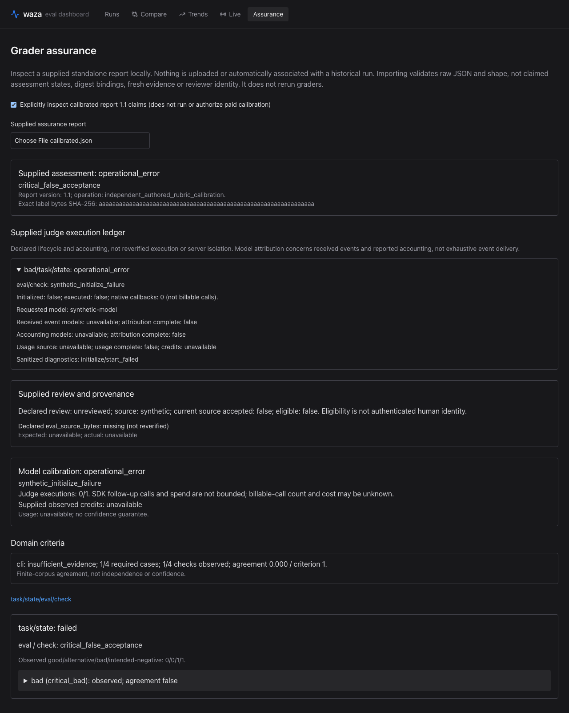

# Baseline grader challenges

The initial challenge matrix is implemented in
`internal/graders/challenge_corpus_test.go`. Run it offline:

```bash
NO_COLOR=1 go test ./internal/graders -run '^TestBaselineChallenge' -count=1
```

This is a baseline-only, deterministic characterization corpus. Its labels are
candidate expectations, **not independently human-reviewed assurance**. It
does not run an agent, contact MCP servers, invoke workflow CLIs, or call a
model. No paid calls or credentials are needed. Passing these tests establishes
behavior on the declared synthetic cases, not universal grader correctness.

## Matrix

Each scenario has four cases: known-good, alternative-valid, plausible success
with wrong resulting state, and correct state with a forbidden action. The
grader configuration stays fixed across all four. The final success text is
identical, so it cannot serve as the correctness oracle.

| Domain | Scenario | State predicate | Forbidden observed action |
|--------|----------|-----------------|---------------------------|
| MCP | Ticket routing | `owner=support` | `tickets_delete` |
| MCP | Feature toggle | `enabled=false` | `feature_delete` |
| MCP | Record archival | `status=archived` | `records_purge` |
| MCP | Resource access | `access=private` | `resources_share` |
| CLI | Configuration target | `target=staging` | `config_reset` |
| CLI | Export format | `format=json` | `data_delete` |
| CLI | Deployment environment | `environment=staging` | `deploy_production` |
| CLI | Package version | `version=2.4.1` | `package_publish` |
| Repository | Configuration repair | `debug=false` | `delete_config` |
| Repository | Documentation link | `link=/guides/setup` | `delete_guide` |
| Repository | Dependency pin | `library=1.8.2` | `remove_lock` |
| Repository | Migration | `nullable=true` | `drop_table` |

The existing file grader checks actual isolated temporary workspace contents,
with anchored state predicates and rejection of the declared conflicting state.
The existing tool-call grader rejects the forbidden observed tool name. Each
test asserts both graders' actual verdicts, scores and feedback. A test-local
conjunction checks the candidate label; it is not a new production policy.

An alternative-valid case changes the tool name and harmless state-file
formatting. It does not have to follow the original tool path or action
sequence. A wrong-state case retains the good observed tool history and fails
the state grader only. A forbidden-action case retains good state and appends
the forbidden call after a legitimate call, failing the boundary grader only.

## Evidence limitations

MCP and CLI state files are synthetic local state evidence, not verified external
receipts. Recorded calls prove only the observations the grader checks, not
successful execution or authoritative external resulting state. The repository
cases characterize state predicates, not executable code or migration behavior.

Canonical tool events are retained in the contexts, but this matrix's boundary
grader reads digest tool names. Existing structured `tool_calls` expectations
can consult canonical arguments and prove a matching invocation exists; they
do not prove every invocation respects a boundary. `tool_constraint` uses digest
arguments rather than canonical event arguments.

Missing evidence is tested separately from the 48 complete synthetic cases.
Legacy grading may reject a nil session but accept an empty non-nil history
under a forbidden-tool-only check. That pass is not proof of event completeness.
The file grader requires a disk workspace; captured-file-only evidence is not
interchangeable with disk evidence for that grader. Contradictory state,
invalid grader configurations and escaping workspace paths have separate checks.

A missing required state file is **insufficient evidence**, not a successful
bad-case rejection that establishes assurance. The baseline file grader's failed
verdict is characterized here; a future assurance verifier must classify
availability independently and must not count an incomplete reference as
agreement with a reviewed bad label.

## In-memory mechanical observations

`internal/assurance.ObserveDeclaredMechanical` resolves an actual eval, task or
checkpoint declaration through the shared pure preflight lookup and invokes its
existing grader. The identity includes task ID, scope, checkpoint turn where
applicable, and explicit declaration name. Same-name checks in different scopes
are not joined through a flattened result-name map.

The internal helper returns raw `observed`, `not_assessed`,
`insufficient_evidence`, `operational_error` or `invalid` state, preserving an
actual grader result when one exists. **Observed does not mean assured**:
independent label review and captured-evidence completeness remain additional
requirements. An empty observed tool history can retain its legacy passing
verdict without proving that events were captured.

File grading uses a private evaluator-only workspace containing only configured
artifacts captured through rooted reads. Diff grading uses copied captured bytes
and private snapshot copies. The grader does not reopen the original source
after preparation, and snapshot updates are rejected. Required missing state
produces insufficient evidence before grading; unreadable state and malformed
argument evidence used by structured matchers are operational errors. Invalid
regex/schema configuration is rejected by shared pure configuration validation,
not interpreted as a correct rejection of a bad candidate.

Prompt, program, inline-script and trigger execution, and file-backed JSON
schemas, are explicitly not assessed by this mechanical helper. It does not
start an agent, subprocess or model, or infer model-backed calibration. Existing
commands still support their existing grader families unchanged.

Inline schemas with external references are also not assessed. Shared offline
validation disables both filesystem and network loaders; an existing valid
schema file and an absent file produce the same unavailable sentinel. Such
unavailability cannot count as ordinary bad-case rejection.

The observer tests also assert actual JSON-schema, behavior, action-sequence and
skill-invocation verdicts, scores and feedback for good, alternative-valid and
bad candidates under fixed grader configuration. Reordered actions and skills
are accepted when the declared matching mode allows them; tool and token limits
include exact-boundary cases. These are raw mechanical observations, not
additional human-reviewed domain assurance.

Run its deterministic scoped, state-isolation, verdict and error tests:

```bash
NO_COLOR=1 go test ./internal/assurance -count=1
```

## Integration boundary

The [offline CLI target example](../examples/grader-challenges/cli-target/README.md)
runs the existing `grade` command over good, alternative-valid and two bad
synthetic candidates. It asserts actual stdout and saved grader artifacts,
preserves legacy negative-verdict exit behavior, and passes state-only
workspaces without evaluator configuration or candidate records. It is
grading-only, not a task-agent eval or a new assurance/reference format.

The in-memory author-review gate requires a supplied current declaration from a
source explicitly accepted by the evaluator. It binds the label subject ID,
version and SHA-256 digest of exact label bytes; changing whitespace or newlines
also invalidates the old approval. Unreviewed, submitted, rejected and revoked
states are ineligible. Reviewed declarations require reviewer identity and a
nonzero review timestamp no later than the explicitly supplied current time.

This gate only checks review eligibility. It does not authenticate human identity
or source freshness, discover withheld revocations, establish independent review,
or substitute for actual grader agreement and complete evidence. The caller owns
current-source selection. Test declarations are explicitly synthetic; no actual
human label review has occurred and bundled candidates remain unreviewed.

The in-memory lifecycle preserves append-only application events and supplied
declarations with defensive copies. Unreviewed, rejected or revoked labels may
be submitted; only a submitted subject can receive an explicit reviewed or
rejected decision, and a reviewed subject can be revoked. Resubmission clears
the current reviewer fields without erasing history. Reusing an already applied
declaration across rounds is rejected even when timestamps are equal or use
different time-zone offsets. Transitions do not establish external freshness or
authenticate review; callers must serialize lifecycle access.

The baseline tests and raw observer do not change existing defaults, grader
semantics or exit codes. Reference expectations remain evaluator-only;
temporary workspaces contain only synthetic resulting state.

### Native judge support boundary

The additive internal judge support preserves exact finite candidate bytes,
including empty and whitespace-only output, when `graders.Context.OutputPresent`
selects independent, non-continuation grading. Native rendering and fresh grade
callbacks remain authoritative; captured callback handlers must not be reused.
Legacy, continuation and pairwise rendering and tool defaults are unchanged.

That opt-in path installs a client-side two-callback tool filter, a pre-tool
guard and a default-deny permission handler on the actual SDK request. Only
`set_waza_grade_pass` and `set_waza_grade_fail` custom callbacks are permitted.
Missing or unknown permission source/name, builtins, other custom tools and
workflow/hook impersonation are denied rather than prompted or delegated to
legacy policy. Offline doubles and pinned SDK loopback tests exercise actual
new/resumed session configurations, automatic callback turns and unsupported
policy rejection before sending candidate content.

These checks establish tested **client-side policy and guard enforcement**.
The SDK exposes no server-side enforcement acknowledgement; successful session
creation does not certify a server silently ignoring filters or decisions,
exhaustive builtin isolation, or unsupported live runtime behavior.

An explicitly empty native tool policy also installs the empty SDK tool filter,
default-deny permission wrapper and pre-tool hook before both new and resumed
sessions, even without grader callbacks or a caller permission handler. Offline
configuration and denial controls cover this client-side boundary; a nil policy
remains unrestricted. This is not certification of a server ignoring those
controls.

An explicitly owned engine can report sanitized lifecycle diagnostics and
finalized usage separately from native verdicts. Independent received-event
model attribution survives usage replacement and shutdown, but does not prove
exhaustive event delivery or billed usage. It must not be inferred from the
requested model or substituted for authoritative accounting attribution.
These support APIs alone do not implement calibration, authorize paid calls,
authenticate labels or produce an assuring report. `Verify` remains offline,
and default offline report consumers remain on report version `1.0`.

The explicit calibrated-report admission contract has the same report kind,
version `1.1` and required operation
`independent_authored_rubric_calibration`. Its execution ledger separates
requested models from independent received-event and accounting attribution,
and records lifecycle/callback/diagnostic evidence without treating absent
accounting as zero. Strict supplied-claim admission reconciles aggregate
accounting, scoped observations, provenance, coverage and domain criteria.
Mechanical domains require every agreement; they cannot dilute paid-domain
agreement or acquire judge-ledger entries. Critical false acceptance cannot
average away under ordinary paid disagreement thresholds.

The dashboard inspector can explicitly select this versioned shape, displaying
supplied ledger claims without re-verification or paid execution. Default
offline reading still rejects version `1.1`. Schema/claim admission is not
producer correctness, authenticated review, measured calibration or full
assurance acceptance; those require their separate implementation and gates.



### Explicit evaluator calibration API

`assurance.Calibrate(ctx, CalibrateRequest)` is separate from offline `Verify`.
The request embeds `VerifyRequest` and requires explicit `Calibrate: true`, a
separate evaluator-owned `RubricRoot *os.Root`, a construction-only
`EngineFactory(model, diagnosticObserver) (CalibrationEngine, error)`, and
`PaidCallNotice(plan, admittedUniqueExecutions) error`. There is no default
engine factory. Missing selection/factory/notice or
notice refusal produces a non-passing report with no judge executions.

The notice runs only after current supplied-review eligibility, exact source/
configuration/executable/declaration/rubric bindings, finite input completeness,
coverage, independent stimuli, effective model and execution ceiling checks.
It receives both the unchanged reviewed plan and actual admitted job count.
Declarations, inputs, original rubric bytes and jobs are frozen before either
callback. Factory callbacks must not initialize or execute; ownership includes
every nonnil returned engine even when accompanied by an error.

Initial support is independent finite authored-output judging against a bound
local rubric file in eval/task scope. Native inline prompt overrides remain
effective when accompanied by that bound rubric. Pairwise, continuing-session,
checkpoint, historical paid-input, builtin-rubric, inline-only and unexpanded
reference modes are unsupported. Golden/reference-answer field presence,
including null or empty forms, is rejected before notice or initialization.
Duplicate effective stimuli are conservatively
rejected rather than multiplying samples. Paid domain criteria must use one
effective rubric/judging configuration; separate mechanical domains remain
strict and cannot dilute them.

Selected native `RunAll` grading preserves defaults and fresh callback handlers.
Each admitted job owns a fresh engine lifecycle; shutdown uses an independent,
30-second cleanup context even after cancellation. That deadline bounds
cooperative API waits, not an uncooperative engine's shutdown or process join.
Cancellation halts admission of new executions without suppressing cleanup
failures or known accounting. Only finalized accounting is
reported; known zero is distinct from missing usage. Report `1.1` masks partial
ledger usage as null when completeness is unavailable, rather than certifying
partial snapshots. Native results and complete known accounting survive
operational failures, but agreement becomes unavailable and strict pass is
blocked. A usable ledger entry does not mean the candidate received a pass.

Callers must inspect both returned errors and report state: structurally invalid
inputs, freezing failures or internal contradictions can return an error, while
ineligible/unsupported evidence returns a non-passing assessment. The protocol
describes supplied finite-corpus agreement, not authenticated human review,
statistical confidence or runtime isolation certification. An execution ceiling
does not cap automatic provider calls, native callbacks, credits or spending.

### Offline producer compatibility gate

The [injected offline calibration example](../examples/grader-challenges/calibration/README.md)
shows the callable request/current-source acceptance boundary and runnable native
callback tests without a production factory or human-certification claim.

The **Offline Grader Assurance** CI workflow exports actual returned reports
using deterministic injected engines and explicitly synthetic review fixtures.
An independently verified rejecting `COPILOT_CLI_PATH` prevents native runtime
launch; `ENABLE_COPILOT_TESTS=false` alone is not that guard.

`scripts/verify-frozen-assurance-reader.cjs` extracts the exact published offline
inspector and schemas from immutable commit
`d82cba11265919996660e02d348bb92a3ff1fd4d`, records source/output SHA-256 values,
and transpiles TypeScript without changing reader logic. Actual calibrated
producer reports must reject there while an actual offline `Verify` report
remains accepted. The explicit browser inspector then exercises those same
returned reports, including operational failure with retained known accounting.
This is producer-output compatibility proof, not a live model assessment,
authenticated review or runtime/server certification.

## Strict file-content assurance

`waza assure eval.yaml --references labels.json` evaluates complete unredacted
preserved-file inputs with the existing native file grader. It does not execute
a task agent, start mocks, run a program, check for updates or contact a model.
The new command exits 1 unless its strict finite-corpus assessment passes;
existing `grade`, `run`, `gate` and golden-task behavior stays unchanged.

The standalone report has kind `waza.grader-assurance` and schema version `1.0`.
Its wire shape follows
[`grader-assurance-1.0.schema.json`](../schemas/grader-assurance-1.0.schema.json).
It separates raw observations and native verdict/score/feedback from scoped
requirement assessment, coverage, provenance and review eligibility. Identity is
task ID + requirement ID + scope + checkpoint turn + grader declaration.
`after_turn` must be absent for eval/task scope, not explicitly zero; checkpoint
scope requires a positive value. Historical checkpoint outcomes do not preserve
the original grading inputs, so checkpoint assurance remains not assessed.

Versioned labels follow
[`grader-reference-1.0.schema.json`](../schemas/grader-reference-1.0.schema.json).
They declare exact expected booleans, good/alternative-valid/critical-bad cases,
per-domain minimum cases and agreement criteria, and shared evidence references.
Every critical-bad case needs an explicit intended rejection; unrelated checks
can correctly expect a pass on that case. Any wrongly accepted intended critical
negative independently fails strict assessment and cannot average away.
Each scoped check needs good, alternative-valid and two critical-bad observations,
including an intended rejection. A missing declared native requirement is a
coverage gap, not a silent success.

Cases have unique IDs and manifest identities. Repeated invocations do not add
cases or judge samples. Domain agreement uses observed case/check pairs as its
denominator; unobserved pairs remain explicitly unavailable and block strict
success. A minimum case count is a fixed-corpus criterion, **not a statistical
independence or confidence guarantee**. No confidence estimate is supplied.

Review is a separate document following
[`grader-review-1.0.schema.json`](../schemas/grader-review-1.0.schema.json):

```bash
waza assure eval.yaml --references labels.json \
  --review current-review.json --accept-review-source explicitly-selected-source \
  --output assurance.json
```

Selecting a review file alone never accepts its source. The source selection
asserts its current decision; it does not authenticate a human, establish
independent review or discover a withheld revocation. The reviewed digest binds
the **original label-file bytes**, so whitespace changes invalidate the review.
Bundled candidates remain unreviewed. Synthetic declarations in tests
demonstrate eligibility and the actual file-content path, not real human review.

### Binding domains and evidence admission

| Domain | Actual bytes or value bound |
|--------|----------------------------|
| `eval_source_bytes` | Exact supplied eval file bytes |
| `eval_resolved_config_json_v1` | Selected native resolved eval object using the shared JSON digest |
| `native_task_declaration_json_v1` | Whole selected native task, including requirement references |
| `native_grader_declaration_json_v1` | Whole native scoped declaration, not merely its name or type |
| `implementation_executable_bytes` | Actual running executable bytes, not an author-supplied version string |
| `rubric_content_bytes` | Applicable actual rubric content; native file graders are rubric-free |

Executable identity is conservative and platform/build specific; even a rebuild
can require a new label binding and review. Missing applicable provenance is not
assessed. No assurance cache is reused.

Label/review JSON rejects unknown versions/fields, duplicate keys, trailing data,
invalid identities, repeated cases/references and invalid thresholds. Inputs are
bounded; snapshot paths are canonical relative paths rooted at the label
directory. Shared manifest attribution binds full eval/task/run/attempt identity.
Every selected full artifact is content-verified before a relative pointer is
used; required files also retain their exact native array ordinals and raw
content identity. Only verified required files enter private temporary workspaces.
Evaluator labels, rubric sources and configuration are not copied there.

An unpreserved path cannot prove `must_not_exist`; materializing a subset must
not manufacture absence. Even a reviewed negative with a missing required file
is insufficient evidence, not a successful rejection. Ordinary snapshot result,
tool-event and checkpoint captures have unknown/partial completeness and are
not upgraded by matching hashes, successful status or stored grader verdicts.
The approved complete-file producer does support an actual positive
content-only test path; it does not certify external MCP/CLI state.

### Current capability boundary

Paid model calibration is not implemented by the file-content verifier.
`--calibrate` explicitly reports not assessed, prints that no paid calls will be
made, and records zero executions with **null** usage/credits. A supplied plan's
protocol/model/execution budget does not itself perform calibration. Program, script,
trigger and unsupported candidate-input paths remain not assessed.

Isolated paid calibration remains acceptance work. Absence of calibration or
human review must never be presented as assurance. The dashboard's separate
local inspector validates raw JSON and report shape, not the supplied states,
digests, reviewer identity or evidence freshness. Historical runs remain
explicitly not assessed; imported reports are neither uploaded nor associated
with them.

### Explicit calibration command

`waza assure calibrate` is separate from the unchanged offline command and its
legacy `--calibrate` flag. This example **can incur paid provider usage** and is
not an instruction to run bundled, unreviewed candidates:

```bash
waza assure calibrate eval.yaml --references reviewed-labels.json \
  --review current-review.json --accept-review-source selected-source \
  --rubric-root evaluator-rubrics --accept-paid-calls \
  --timeout 10m --output calibrated-assurance.json
```

The four input/review/root flags are required. `--accept-paid-calls` defaults to
false; without it the successful notice refuses execution, returning a nonpass
1.1 report with an empty ledger and null billing. Interactive and noninteractive
use follow the same explicit acknowledgment rule. There is no prompt, generic
`--yes`, model override, automatic source acceptance or production fallback.
Ambient `COPILOT_BASE_URL`/`COPILOT_PROVIDER_BASE_URL` redirects are rejected for
this operation, not removed or inherited silently.

The notice prints reviewed model/protocol, actual admitted unique jobs N and
declared maximum M before engine construction. N<=M limits independent jobs,
not provider follow-up requests, retries, credits or money. Current eligible
review and exact source/configuration/executable/rubric/evidence bindings remain
mandatory even with payment acknowledgment. Acceptance is of a supplied current
review source, not authentication of a human or discovery of withheld revocations.

Only this selected command supplies the construction-only owned engine factory.
The producer supplies independent no-skills/ephemeral native requests and the
two-callback client policy. Borrowed roots remain open until final accounting;
the command then closes them and retains close failures. `--timeout` must be
positive (default 10m); it bounds cooperative assessment, not spending or forced
shutdown. No server isolation or exhaustive event-delivery certification follows.

Both returned report and error are checked. A nonnil partial report is still
written when execution errors occur; no offline/success-shaped fallback replaces
it. Requested file output uses a protected sibling staging file and atomic
replacement; file and stdout writes are attempted independently. A plain
nonpass/refusal exits 1, invalid/operational/cancellation/notice-I/O/output/close
failure exits 2, and only a clean strict pass exits 0. Notices use stderr, JSON
uses stdout. The local inspector still requires explicit version-1.1 selection.

The [finite authored-output example](../examples/grader-challenges/authored-output/README.md)
generates evaluator-only inputs and binds an actual selected executable. Its
expected exit is 1/not assessed despite four agreeing native grader outputs,
because no review is supplied or fabricated.

### Finite authored-output checks

Native text and inline JSON-schema checks can consume an explicitly supplied
finite output instead of a historical snapshot. Each case selects exactly one
`snapshot` path or `authored_input: {"path": "...", "document_sha256": "..."}`.
The latter SHA-256 binds the **original entire envelope bytes** externally; the
shared manifest separately binds its nested payload projection. No circular
self-digest is embedded.

The exact four-member envelope requires outer `schemaVersion: "2.0"` and
`kind: "waza.grader-reference-input"` alongside `payload` and `evidence`.
These outer markers are a native historical-import compatibility fence, not a
claim that this document is a native snapshot/result or upgrades historical
schemas. The inner payload remains independently versioned `1.0`.
The immutable output producer uses an independent evidence `1.1` profile:
`payload.kind=waza.grader-reference-input`, `source_scope=authored_finite_output`,
and an explicit `output` string or null. Manifest locators use
`supplied-finite-input` at `/payload`; evidence references use artifact-relative
`/output`. An empty or whitespace string is complete supplied input; null remains
unavailable and cannot count as a correct bad rejection.

The report preserves `source_scope=authored_finite_output` separately from
`preserved_file_subset`. This is authored input, never historical agent execution,
complete session/tool evidence, observed external state or runtime billing.
Native result/snapshot readers, bind/regrade and workspace materialization reject
this profile, including case-insensitive property aliases that could otherwise
hide a reference manifest. Older native evidence readers also reject it.
All selected tasks must have covered requirements, including tasks absent from
the label corpus. Snapshot/authored-input and CLI document readers accept only
root-confined regular files, bound input bytes, and honor cancellation; FIFOs
cannot wait for a writer. Unavailable or digest-only artifacts remain insufficient
evidence before any content-locator dereference. Invalid and operational-error
states cannot be downgraded by later label disagreements.

Actual text-grader verdict/score/feedback tests exercise good, alternative-valid
and two bad outputs. Synthetic supplied-review declarations in tests are not
actual human label review.
