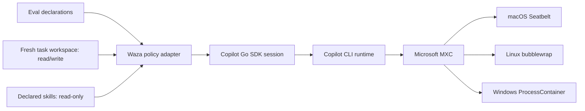

# Copilot-native evaluation sandbox

## Problem

Waza evaluations run model-selected commands and bundled skill scripts without
an interactive operator approving each action. A permission callback alone does
not prevent a command from reading unrelated host files, modifying files outside
the task workspace, inheriting host secrets, or reaching the network. This makes
an otherwise disposable evaluation capable of affecting or exposing the machine
that launched it.

The required boundary is task-specific: the model needs read/write access to one
fresh workspace, read-only access to declared skills, and no other capability
unless the eval explicitly opts in. Waza must provide that boundary without
creating and maintaining its own macOS, Linux, and Windows sandbox engines.

## Decision

Waza will optionally configure the Copilot SDK executor to run model-visible
commands inside Copilot CLI's native OS sandbox. Waza supplies the per-task
filesystem boundary; Copilot CLI and Microsoft Execution Containers (MXC)
enforce it.

Waza will not implement a second process sandbox, shell wrapper, chroot, or
platform-specific policy engine.

## Standardised solution

The Copilot SDK is Waza's control plane; the Copilot CLI runtime is the execution
layer. Waza derives a least-privilege policy from existing eval declarations and
sends it to the CLI through the SDK's session RPCs. Copilot and MXC translate the
same policy to the supported operating-system backend. Waza does not generate
Seatbelt profiles, invoke bubblewrap, or manage Windows ProcessContainer itself.



This is the same architectural pattern used by other coding harnesses: the host
selects a workspace, capability policy, and approval posture, while the harness's
native runtime owns OS enforcement. It keeps Waza portable and limits its role to
the eval-specific information that Copilot cannot infer.

## User contract

Sandboxing is opt-in and therefore does not change existing evaluations:

```yaml
config:
  executor: copilot-sdk
  sandbox:
    enabled: true
    allow_dev_tool_caches: false
    allow_outbound_network: false
    allow_local_network: false
    git_auth: false
    gh_auth: false
    readonly_paths: []
    readwrite_paths: []
```

When enabled, Waza derives filesystem access from existing eval declarations:

| Resource | Access |
| --- | --- |
| Fresh task workspace | Read/write |
| Explicit `skill_directories` | Read-only and executable through Copilot's native skill loading |
| `inputs.files` fixtures | Read/write after Waza copies them into the workspace |
| Git resources | Read/write after Waza materialises them inside the workspace |
| System temporary directory | Denied |
| Waza launch directory and other host paths | Denied |

Eval authors use `skill_directories`, `inputs.files`, and Git resources as the
single source of truth for evaluated content. Optional `readonly_paths` and
`readwrite_paths` exist only for declared host prerequisites that Copilot cannot
materialise, such as a package cache or enterprise CA bundle. Values must be
absolute after `~` and environment-variable expansion; references to unset
or empty variables and paths that do not exist fail validation. Waza resolves
symlinks before granting access and rejects paths that overlap the system temp
root or receive both read-only and read/write grants. The lists default to empty
and never replace the workspace or skill permissions.

Waza passes declared skill directories to Copilot's native skill loader and grants
those same canonical paths read-only access. This lets invoked skills run bundled
scripts relative to their own `SKILL.md` without copying the skill or creating a
second discovery convention. On Windows, Copilot local sandboxing currently
requires a Windows Insiders build.

Sandboxed task workspaces live under the operating system's user-cache
directory while the executor is running. This keeps them outside the denied
system temp root. Waza retains a workspace through follow-up turns and grading
because existing file, diff, and program graders consume its path, then removes
it during normal executor shutdown. `--keep-workspace` remains the explicit
debugging opt-in. A process crash can leave a stale cache directory; it does not
widen the sandbox policy for another task.

The optional flags and path lists expose only capabilities that an eval may
genuinely require. Their zero values are the safe, hermetic defaults. Sandbox
bypass requests are always rejected because Waza runs non-interactively and
cannot obtain informed human approval for an unsandboxed command. Requests that
managed policy marks as requiring explicit human approval are also rejected.

The runner passes the eval sandbox configuration and resolved skill directories
to the Copilot executor. After session creation or resume, the executor:

1. updates the session's native sandbox options;
2. configures Copilot's path-permission manager with the task workspace and
   declared skills;
3. rejects any permission request that asks to bypass the sandbox or requires
   interactive managed-policy approval; and
4. fails the task closed if Copilot policy configuration fails.

An omitted or disabled `sandbox` block sends no sandbox configuration RPC and
uses the existing Copilot client process configuration. The field itself still
requires schema 1.3 and the `copilot-sdk` executor, including when disabled. Waza
therefore never weakens a sandbox policy inherited from Copilot or an organisation
and does not change existing evaluations that omit the block.

## Copilot process environment

The Copilot CLI subprocess is shared across sessions, so its environment cannot
be isolated by per-session sandbox policy. Waza therefore uses a distinct shared
client process for sandboxed evaluations and gives that process a minimal
operational environment. It retains standard runtime, locale, temporary-directory,
proxy, CA-bundle, XDG, Windows runtime, and `COPILOT_HOME` variables from an
explicit allowlist; arbitrary host variables are not inherited. Proxy values
containing credentials or URL components beyond the proxy origin are omitted
rather than exposing them to child tools.

GitHub authentication is passed explicitly through the Copilot SDK, in the
precedence `COPILOT_GITHUB_TOKEN`, `GH_TOKEN`, then `GITHUB_TOKEN`. When none is
set, Copilot can use its persisted login through the retained home directory.
Custom provider credentials remain in Waza and are supplied in the per-session
provider configuration rather than the CLI process environment.

Unsandboxed evaluations retain the existing inherited process environment. The
sandbox opt-in is part of Waza's shared-client compatibility key, so sandboxed
and unsandboxed sessions never share a CLI process. Proxy variables are retained
in a sandboxed process only when they are credential-free URLs. The executor
rejects a sandboxed request if its client was not created with the restricted
environment, preventing future callers from silently splitting those two halves
of the boundary.

Model-backed prompt-grader turns inherit the evaluated task's sandbox policy and
reuse its workspace boundary. Post-execution program graders are different:
their configured commands are trusted Waza extensions, execute after the model
turn with the launcher process's host permissions, and are not protected by the
Copilot sandbox. Operators must review program graders and must not treat
model-created workspace content as trusted command input.

## Safety boundaries

- Sandboxed Copilot CLI processes receive an allowlisted environment, but
  retained credential-free proxy and CA configuration remain visible to child
  tools.
- Copilot applies the OS sandbox to local MCP and LSP subprocesses by default.
  Remote MCP servers are outside the local process boundary.
- Copilot's built-in file tools run in the CLI process and enforce the configured
  policy in application code on a best-effort basis rather than through MXC.
- Prompt graders retain the task sandbox. Program graders run after agent
  execution with host permissions and remain an explicitly trusted extension
  boundary; sandboxing them requires a separate executor design.
- Workspace capture excludes symlinks so post-run grading cannot follow a
  model-created link outside the task boundary.
- The Copilot sandbox is a filesystem, network, and credential boundary; it does
  not impose CPU, memory, process-count, or output-size quotas. Run untrusted or
  adversarial evaluations inside an outer resource-limited environment.
- Copilot's sandbox implementation is experimental. Unsupported hosts and
  rejected policies fail the task rather than silently running unsandboxed.

## Verification

Deterministic tests cover configuration parsing, workspace/skill policy
derivation, safe defaults, explicit capability opt-ins, bypass rejection,
configuration failure, unset path variables, opt-in environment sanitisation,
no-op disabled configuration, canonical workspace/path and overlap validation,
and capture-time exclusion of file, directory, chained, and dangling symlinks.

An opt-in live Copilot test uses disposable files only. It must demonstrate
that a model-visible shell can read and write its task workspace and execute a
read-only skill script, while reads and writes outside the boundary fail and
leave no escaped files. A concurrent live test gives two sessions different
path policies and proves neither can use the other's access. The tests run only
when live Copilot tests are explicitly enabled.

## Definition of done

- Existing evals send no new sandbox policy RPC and retain their existing
  Copilot process environment when `config.sandbox` is omitted.
- A sandboxed task can use workspace fixtures and invoke bundled skill scripts
  through Copilot's native skill-directory support.
- A sandboxed task cannot read or write unrelated host files.
- Post-run workspace capture cannot follow model-created symlinks outside the
  workspace.
- Concurrent task policies remain session-local.
- Arbitrary host environment variables are not inherited by sandboxed Copilot
  CLI processes; explicit token authentication and the persisted-login location
  remain available.
- Network, developer-tool cache access, and credential injection are disabled unless
  explicitly enabled by the eval.
- Sandbox bypass is impossible through Waza's non-interactive permission
  handler.
- Unit tests, live file canary, schema validation, documentation, and the full
  Go test suite pass.
