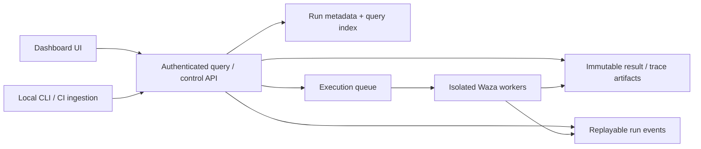

import ZoomImage from '../../../components/ZoomImage.astro';

`waza serve --lab` opens the **experimental real-results dashboard** at `/#/lab`.
The classic dashboard remains available at `/#/` on the same server. The Go
evaluation engine is unchanged; the lab is a viewer, not an execution service.

<ZoomImage src="../../images/dashboard-lab-overview.png" alt="Dashboard lab with linked quality charts, model performance, attention items, and run history." />

The screenshots show the separately labeled **synthetic demo** at `/#/lab/demo`.
The default lab reads your saved Waza results, never substitutes synthetic data
on errors, and labels unsupported metadata as unavailable.

## Run locally

For a dashboard built from this source tree:

```bash
waza serve --lab --results-dir ./results --no-browser
# Open http://localhost:3000/#/lab
# Classic dashboard: http://localhost:3000/#/
```

`--lab` chooses the printed and auto-opened URL. It does not redirect the root
or replace classic views. `--lab` and `--tcp` are mutually exclusive. The server
keeps its existing loopback bind; no cloud authentication or hosting is added.

Local artifacts refresh every 15 seconds or with **Refresh results**.
Storage-backed results use the existing configured storage adapter. Loading,
refresh failures, stale results, and retry actions are visible. The default
window is **All time**, so older histories remain accessible.

For frontend-only exploration of the synthetic demo, no Go server is needed:

```bash
cd web
npm ci
npm run dev -- --host 127.0.0.1
# Open the URL printed by Vite, followed by /#/lab/demo
```

A previously installed Waza release does not gain the lab merely by checking out
this source. Build the frontend and binary to embed the updated dashboard, or use
the frontend-only development workflow above.

## Explore the real-results dashboard

| Workspace | Working interactions |
|---|---|
| Overview | Eval/skill/model/window filters, selectable quality-chart dates, model cross-filtering, failing-run drilldown |
| Current runs | Select a saved run and inspect artifact-derived SSE activity; reconnection, deduplication, and terminal states |
| Run history | Search, outcome filters, evidence inspection, and selection of two runs from the same eval |
| Compare | Baseline/candidate selection, reported weighted task-score deltas, regression evidence, added/missing task coverage |
| Reports | Filtered JSON/CSV downloads and browser print/save-PDF |
| Skills & evals | Suites observed in run history; readiness, requirement coverage, and skill token budgets explicitly unavailable |

Try **Overview → failing run → Grader evidence → Trajectory → Reports**.
The inspector uses actual recorded prompts, graders, session digests, responder
metadata, model usage, and the existing trajectory viewer. It supports keyboard
focus containment, Escape to close, and focus restoration. Detail artifacts are
loaded on demand rather than downloading all transcripts for the overview.

<ZoomImage src="../../images/dashboard-lab-compare.png" alt="Baseline comparison with aligned task scores, regressions, and added task coverage." />

Scope filters apply to historical summaries, tables, comparisons, reports, the
observed catalog, and activity run selection. Selecting a chart date filters runs
while the trend retains the time-window context.

**Current runs is saved-result replay**, not an active-worker monitor. The
existing API reconstructs task/grader events and timestamps from result
artifacts. Browser reconnections resume with `Last-Event-ID`. The lab closes
terminal or malformed streams, reports connection errors, and clears activity
when the selected run changes. Start/cancel/retry controls and real execution
discovery are not available.

### Data honesty

- A task pass rate is distinct from its weighted quality score.
- Task scores aggregate repetitions; grader evidence and trajectories describe
  the **first repetition**, not every trial. Missing weighted scores remain unavailable.
- AI Credits use authoritative API values, never token-derived estimates.
  Unknown billing is shown as unavailable; aggregate credit values are explicitly
  **known subtotals**, with reporting coverage.
- Baselines are scoped to the same nonempty eval identity. Tasks align by stable
  IDs, or unique legacy names when both artifacts lack IDs. Duplicate identities
  are non-comparable, not silently paired.
  Added/missing tasks are **not comparable**, not zero-score regressions.
- Comparisons are descriptive, not claims of statistical significance.
- Eval names do not prove matching spec/grader revisions; verify compatibility
  before drawing conclusions. Git revisions and full configurations are unavailable.
- JSON exports have their own report format marker and `synthetic: false`, with
  selected API run details. Detail downloads use bounded concurrency; any failure
  aborts the export without downloading a partial report. These reports are not
  Waza `EvaluationOutcome` artifacts. CSV preserves numeric credit precision and
  leaves unknown fields empty; browser print can save a PDF.

### Isolated synthetic demo

`/#/lab/demo` retains the original UX mock with deterministic 84-run fixtures
dated October 6, 2026, illustrative configuration/readiness/CI metadata, and
browser-only current-run playback. Try **Overview → Azure deploy regression →
Respect the tool policy → Grader evidence → Trajectory → Reports**.
This demo makes no API requests, never executes evaluations, and exports
`synthetic: true` reports. Playback jobs are separate from historical reports.
It is never selected automatically after a real-data error.

## Research and design rationale

Research observed on **2026-10-06**. These are independently verified reference
patterns, not copied implementations or promises of feature parity.

| Reference | Verified capability | Waza design implication |
|---|---|---|
| [Aspire dashboard](https://aspire.dev/dashboard/overview/) | Resource state in AppHost mode; logs, traces, metrics, correlated inspection; standalone OTLP viewer | Treat current runs and evidence inspection as first-class operational workspaces, not just charts |
| [Flint Chart](https://github.com/microsoft/flint-chart) | Semantic chart specs, visual themes, multiple rendering backends | Make chart meaning and visual conventions consistent across reports |
| [Flint interactions](https://github.com/microsoft/flint-chart/blob/main/docs/interaction-spec.md) | Highlighting, linked brushing, navigation, annotations, keyboard targeting; documented `interaction_spec` support on the Vega-Lite interactive surface | Connect chart selection to application-level filters and task evidence |
| [Vally serve](https://github.com/microsoft/vally/blob/main/docs-site/src/content/docs/reference/cli/serve.mdx) | Results-directory serving, optional SQLite history, paginated REST API, score matrix, rankings, grader/tool analysis, comparison | Separate queryable historical analytics from artifacts and foreground grader failure analysis |
| [Vally dashboard source](https://github.com/microsoft/vally/blob/main/packages/server/src/dashboard/index.ts) | Chart.js charts for duration, tokens, results/tool distributions; all-outcomes exploration and model comparisons | Use comparison and score matrices to explain outcomes, rather than a wall of aggregate charts |
| [Braintrust comparisons](https://www.braintrust.dev/docs/evaluate/compare-experiments) | Baselines, aligned test cases, regression/improvement deltas, report export | Make regression → evidence → shareable report a coherent journey |
| [Promptfoo web UI](https://www.promptfoo.dev/docs/usage/web-ui/) | Search/filterable result tables, cell inspection, comparison, config visibility, exports | Preserve a dense evidence table alongside visual exploration |
| [Langfuse datasets](https://langfuse.com/docs/evaluation/experiments/datasets) | Project-scoped datasets with inputs, expected outputs, and experiment workflows | Give eval suites and their versions a visible home rather than only listing executions |

Vally's inspected dashboard/server surfaces were oriented toward stored outcome
analytics. We did not find an SSE live-run or execution-control UI there. Its
configurable network bind and host-header protections do not constitute a complete
authenticated multi-user cloud service. This is a scoped source observation,
not a claim that Vally cannot add those capabilities.

This prototype uses **native SVG/React charts inspired by Flint**, not the Flint
package. It implements date/model cross-filtering; it does not claim linked
brushing, pan/zoom, or every Flint preset. A future integration should evaluate
Flint's Vega-Lite interactive surface, route semantic events into shared filter
state, validate per-chart interaction support, and measure bundle/runtime cost.
It need not use Flint's hosted MCP service or send private eval data anywhere.

## Waza feature coverage

The lab makes room for the full lifecycle, but **does not implement every
CLI command in the browser**.

| Existing Waza surface | Prototype representation | Production work still needed |
|---|---|---|
| Skill/custom-agent authoring, scaffolding, suggestions | Skills/evals catalog and capability map | Suite discovery, editing, validation, registry/lock provenance |
| Sensei/readiness, tokens, spec verification, coverage | Illustrative per-skill quality/coverage/budget | Real check/coverage outputs and artifact links |
| Eval model, judge, repetitions, weighted graders | Real history, recorded metadata, score matrix, grader evidence | Full-fidelity repetition-level data and configuration |
| Triggers, responders, command mocks, fixture isolation | Configuration/capability map | Dedicated outcomes, sanitized command evidence, invocation inspection |
| Custom-agent tool policies | Actual digest/trajectory denials in the inspector; illustrative demo denial | Richer invocation and policy analysis |
| Token, request, per-model AI Credit diagnostics | Real summary totals, precise credits/coverage, task digest, model usage in recorded metadata | Dedicated session-ledger and per-model analysis views |
| Snapshot/replay, adversarial packs, telemetry | Trajectory and capability map | Real snapshot/fault-pack links and trace correlation |
| Compare, CI, storage, result reports | Real storage sources, stable-task comparisons, report download | Compatible spec versions, CI/revision provenance, durable ingestion |
| Runtime progress/cancellation/retries | Artifact-derived SSE replay; explicit demo playback | Authoritative worker state, live events, authenticated run-control APIs |

The real catalog derives observed suites from results; it does not discover all
installed skills. Readiness, coverage, token budgets, and git revisions remain
unavailable. The synthetic catalog is illustrative only.

## Local-first and cloud architecture

**Current implementation:** a lazy-loaded React route with scoped light styles,
polled real-result summaries, lazy evidence loading, replayable SSE, and in-browser
exports. `GET /api/v1/lab/runs` refreshes local artifacts without changing classic
listing behavior. Additive API metadata includes skill, repetitions, weighted
scores, and stable task IDs. The original dashboard retains its shell, routes,
and dark theme. No new storage, authentication, or deployment resources are added.

**Recommended future architecture:** the same UI and versioned query/event
contracts in both deployment modes, with execution separated from viewing.



Locally, preserve loopback defaults and use the existing result artifacts with a
durable query index (SQLite is a candidate). In a shared cloud service, introduce
identity, project authorization, durable database/object storage, and separate
execution workers. Choose the cloud provider and deployment product after
validating the UI and execution requirements.

Production requirements include retention, redaction, audit trails, pagination,
artifact/spec revisions, stable task/run identity, retry/attempt provenance, and
authoritative run states. Existing artifact-derived SSE replay is useful prior
art, but must not be described as a worker queue or proof of real-time execution
control. A live event contract needs sequence/resume behavior, disconnect/error
states, and reconnect handling.

### Hosting the mock

`npm run build` produces static frontend assets. Those assets can be served by a
static host without credentials or an API for `/#/lab/demo`; the real lab and classic dashboard
routes still need Waza's API. Keep the lab's synthetic banner intact. Static
hosting demonstrates UX only, not a hosted eval service.

Build output belongs to the existing embedded dashboard pipeline. Do not commit
generated hashed asset references as an incidental build change.

## Verification

```bash
cd web
npm run build
npm run lint
npx playwright test e2e/dashboard-lab.spec.ts e2e/dashboard-lab-real.spec.ts --project=chromium
npx playwright test e2e/screenshots.spec.ts --project=chromium --grep dashboard-lab
```

Browser coverage exercises real summaries, arbitrary models, lazy evidence,
precision, API errors/retries/refresh, stable and legacy IDs, duplicate identities,
report failures, event replay/deduplication/reconnection, and the isolated demo.
Go coverage checks flag selection/TCP exclusion, launch URLs, metadata mapping,
storage provenance, and refreshed artifacts. Run the classic dashboard suite as
well when changing shared routing or export helpers.
